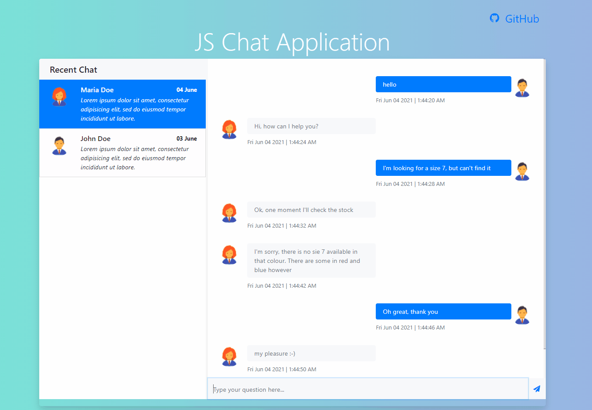

# javascript-chat-app
Simple JavaScript App with sending message from user as visitor and getting random response from operator.

## Demo URL: 
https://tejassavaliya.github.io/javascript-chat-app/

### Below points added in this application
 * Designed Chat Layout
 * Created Function to show realtime chat interface 
 * To Get / Receive message used dummy function ( for operator and visitor ) 
 * Loaded the chat history from dymmy api function

 #### Demo Image

